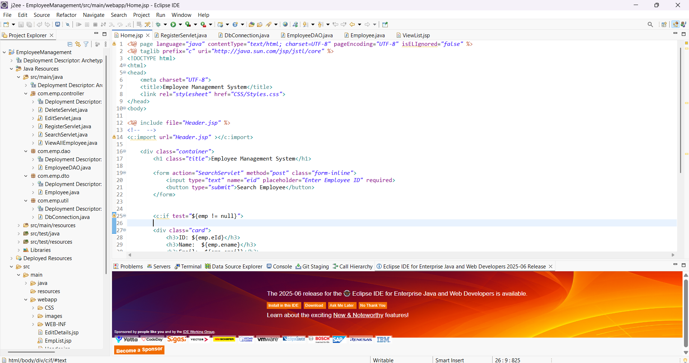
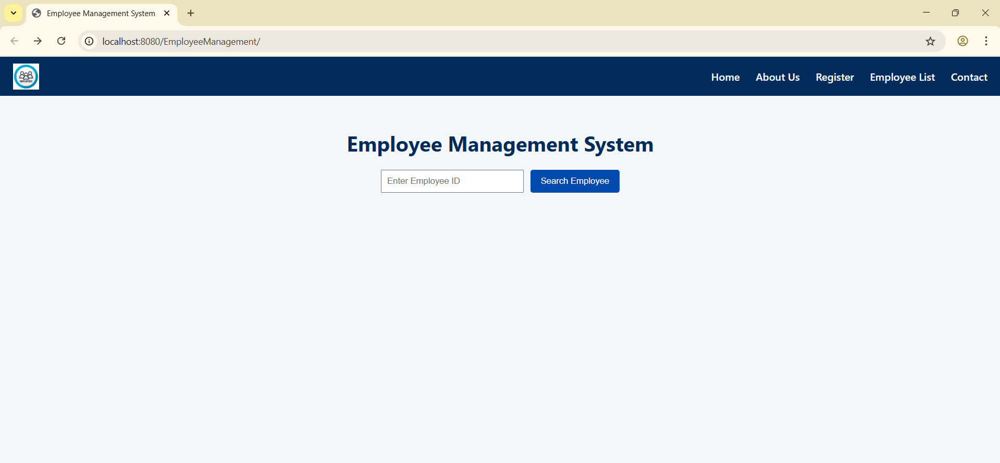
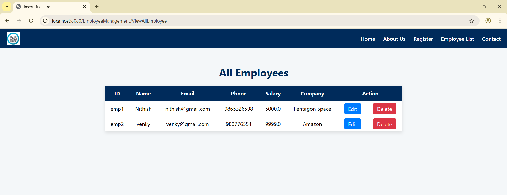
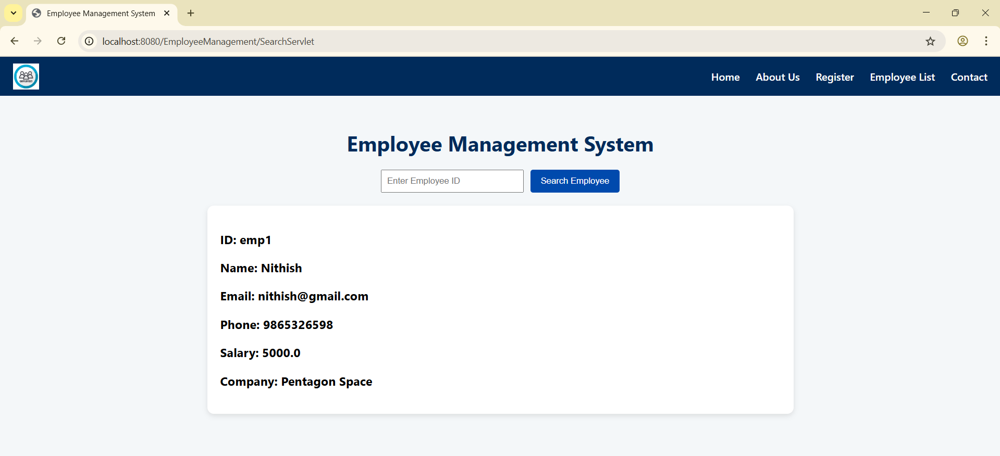

# EmployeeManagement

A simple **CRUD-based web application** built using **Java, JSP, Servlets, JDBC, and Maven**.  
This small project demonstrates basic Create, Read, Update, and Delete operations for managing employee records using an MVC structure.

---

## ✨ Features
- ➕ Add new employees  
- 📋 View all employees  
- ✏️ Edit employee details  
- ❌ Delete employees  

## 🛠 Tech Stack
- **Backend:** Java (Servlets, JSP)  
- **Frontend:** HTML, CSS (JSP pages)  
- **Database:** MySQL (JDBC)  
- **Build Tool:** Maven  
- **Architecture:** MVC (Model-View-Controller)  

## 📂 Project Structure
```
EmployeeManagement/
┣ src/
┃ ┣ main/
┃ ┃ ┣ java/com/emp/controller/   # Servlets (CRUD logic)
┃ ┃ ┣ java/com/emp/dao/          # DAO layer
┃ ┃ ┣ java/com/emp/dto/          # DTO (Employee object)
┃ ┃ ┗ java/com/emp/util/         # Database connection (DbConnection.java)
┃ ┗ webapp/                      # JSP pages, CSS, images
┣ pom.xml                         # Maven dependencies
┗ screenshots/                    # Project screenshots (for README)
```

## ⚡ How to Run (Quick)
1. Clone the repository:
   git clone https://github.com/NITHISH-KUMAR-M-S/EmployeeManagement.git
   cd EmployeeManagement
   
3. Import as a **Maven Project** in Eclipse or IntelliJ (File → Import → Existing Maven Project).
4. Configure **MySQL database** (run these in your MySQL client):

   ```sql
   CREATE DATABASE employee_db;
   USE employee_db;

   CREATE TABLE employee (
       id INT PRIMARY KEY AUTO_INCREMENT,
       name VARCHAR(100),
       email VARCHAR(100),
       department VARCHAR(50),
       salary DOUBLE
   );
   ```
5. Update DB credentials in `src/main/java/com/emp/util/DbConnection.java` (URL, username, password).
6. Build the project (optional) and deploy to **Apache Tomcat**:

   * Build: `mvn clean package`
   * Deploy the generated WAR to Tomcat `webapps/` or run from your IDE on a configured Tomcat server.
7. Open in browser:

   ```
   http://localhost:8080/EmployeeManagement
   ```

---

## 📸 Screenshots

<table>
  <tr>
    <td align="center">
      <br>
      <b>Code Page</b>
    </td>
    <td align="center">
      <br>
      <b>Home Page</b>
    </td>
    <td align="center">
      <br>
      <b>Register Employee</b>
    </td>
  </tr>
  <tr>
    <td align="center">
      <br>
      <b>Employee List</b>
    </td>
    <td align="center">
      <br>
      <b>Employee Details (Edit)</b>
    </td>
    <td></td>
  </tr>
</table>


---

## 📌 Learning Outcomes

* Implemented **CRUD operations** in a Java web app
* Applied the **MVC design pattern** using Servlets (controller), DAO/DTO (model), and JSP (view)
* Integrated Java application with **MySQL** using JDBC
* Familiarity with **Maven** and deploying webapps to Tomcat

---

## 🤝 Contributing

Contributions, issues, and suggestions are welcome.
If you want to contribute:

1. Fork the repo
2. Create a branch (`git checkout -b feature-name`)
3. Commit your changes (`git commit -m "Add feature"`)
4. Push to the branch (`git push origin feature-name`)
5. Open a Pull Request

---

## 📜 License

This project is for **educational purposes**. Feel free to use and modify.

---

## 🔧 (Optional) Git commands — push local project to GitHub

If your project is local and you haven't pushed yet, run:

```bash
git init
git add .
git commit -m "Initial commit - EmployeeManagement"
git branch -M main
git remote add origin https://github.com/NITHISH-KUMAR-M-S/EmployeeManagement.git
git push -u origin main
```

```

If you want, I can:
- paste this directly into your `README.md` and create a PR (if you want me to edit the repo), or  
- give a version with **relative image paths** instead of raw links.  

Which would you prefer next?
```
